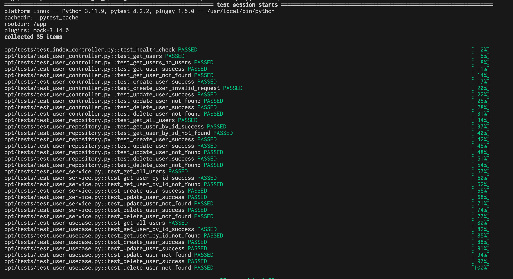

# Flask API with Clean Architecture

## 概要
このプロジェクトは、Flaskフレームワークとクリーンアーキテクチャを使用して構築されたAPIです。クリーンアーキテクチャに基づいて設計されており、コードの保守性、拡張性、テスト容易性が向上しています。このドキュメントでは、プロジェクトの構成、使用方法について説明します。


[](https://www.docker.com/)


[](https://www.python.org/)
[](https://docs.docker.com/compose/)
[](https://palletsprojects.com/p/flask/)
[](https://pytest.org/)

[](https://www.mysql.com/)


# 特徴
+ クリーンアーキテクチャ: ビジネスロジックをUIやデータソースから分離することで、コードの保守性、テスト容易性、再利用性を向上させています。
+ Flaskフレームワーク: Python製の軽量で柔軟なWebフレームワークを利用することで、API開発を効率化しています。
+ Dockerfile: 保守性の高いDockerfileにより、開発環境、テスト環境、本番環境の構築を容易にし、異なる環境間での依存関係の差異を解消しています。

# クリーンアーキテクチャに基づいたディレクトリ構成

```
.
├── __init__.py
├── application
│   ├── __init__.py
│   ├── repositories
│   │   ├── __init__.py
│   │   └── user_repository.py
│   ├── services
│   │   ├── __init__.py
│   │   └── user_service.py
│   └── usecases
│       ├── __init__.py
│       └── user_usecase.py
├── domain
│   ├── __init__.py
│   └── user.py
├── framework
│   ├── __init__.py
│   └── database
│       ├── __init__.py
│       └── models.py
├── interface
│   ├── __init__.py
│   └── router
│       ├── __init__.py
│       ├── index_controller.py
│       └── user_controller.py
├── main.py
├── settings.ini
├── settings.py
├── tests
└── utils
    ├── __init__.py
    └── helper.py
```

### application層
アプリケーションのビジネスロジックを実装する層です。主にユースケースやサービス、リポジトリのインターフェースを定義しています。

+ repositories: データの永続化に関するインターフェースを定義します。
+ services: ビジネスロジックを実装します。
+ usecases: アプリケーションのユースケースを実装します。

### domain層
システムのビジネスルールを定義する層です。エンティティやドメインオブジェクトが含まれます。
+ user.py: ユーザーに関するドメインモデルを定義します。

#### framework層
インフラストラクチャの実装を提供する層です。データベース接続や外部ライブラリとの連携を扱います。
+ database: データベース関連の実装が含まれます。

### interface層
外部インターフェースを提供する層です。コントローラーやルーティングなど、APIのエントリーポイントを定義します。

+ router: ルーティングとコントローラーを定義します。
その他のファイルとディレクトリ
+ main.py: アプリケーションのエントリーポイントです。
+ settings.ini: 設定ファイルです。
+ settings.py: 設定の読み込みと管理を行います。
+ tests: テストコードを配置するディレクトリです。
+ utils: ユーティリティ関数やヘルパーを定義します。
この構成により、各層の責任が明確に分離され、依存関係の管理が容易になります。これにより、システムの保守性、拡張性、テスト容易性が向上します。

# 使用方法
1. 以下のコマンドでコンテナを立ち上げる。
```
docker compose up
```
2. apiにアクセス
http://localhost:8000/


# テスト結果

<p align="center">
  
</p>
